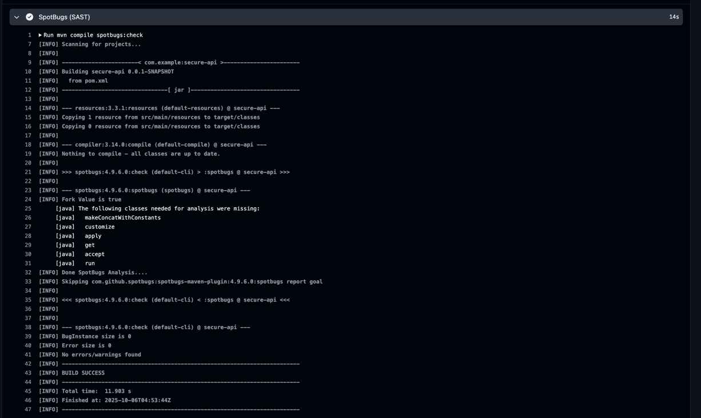
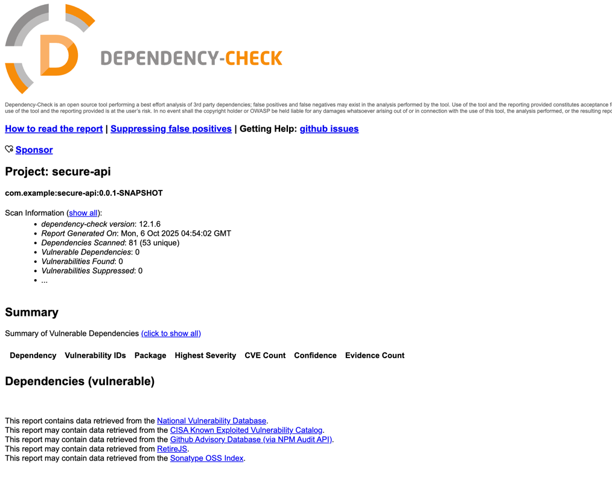

## Описание проекта

Защищенный REST API, разработанный на Java Spring Boot с интеграцией CI/CD и защитой от основных уязвимостей OWASP Top 10

## Технологический стек

- **Java 17**
- **Spring Boot 3.5.6**
- **Spring Security**
- **JWT для аутентификации**
- **PostgreSQL**
- **Maven**
- **SpotBugs + FindSecBugs** (SAST)
- **OWASP Dependency Check** (SCA)

## API Endpoints

### Публичные эндпоинты (не требуют аутентификации)

#### 1. Регистрация пользователя
```http
POST /auth/register
Content-Type: application/json

{
    "username": "newuser",
    "password": "securePassword123"
}
```
```bash
curl -X POST http://localhost:8080/auth/register \
  -H "Content-Type: application/json" \
  -d '{"username":"testuser","email":"test@example.com","password":"password123"}'
```

#### 2. Аутентификация пользователя
```http
POST /auth/login
Content-Type: application/json

{
    "username": "user",
    "password": "user123"
}
```
```bash
curl -X POST http://localhost:8080/auth/login \
  -H "Content-Type: application/json" \
  -d '{"username":"user","password":"user123"}'
```

Ответ:
```json
{
    "token": "eyJhbGciOiJIUzUxMiJ9..."
}
```

### Защищенные эндпоинты (требуют JWT токен)

Для всех защищенных эндпоинтов необходимо добавить заголовок:
```
Authorization: Bearer <JWT_TOKEN>
```

#### 1. Получение списка пользователей
```bash
curl -X GET http://localhost:8080/api/data \
  -H "Authorization: Bearer <YOUR_JWT_TOKEN>"
```

#### 2. Создание нового поста (только для пользователей с ролью ADMIN)
```http
POST /api/posts
Content-Type: application/json

{
    "title": "Post Title",
    "content": "Post content with at least 10 characters"
}
```
```bash
curl -X POST http://localhost:8080/api/posts \
  -H "Authorization: Bearer <YOUR_JWT_TOKEN>" \
  -H "Content-Type: application/json" \
  -d '{"title":"My Post","content":"This is my secure post content"}'
```


## Реализованные меры защиты

### 1. Защита от SQL инъекций
- Использование JPA/Hibernate с параметризованными запросами
- Никакой конкатенации строк для SQL запросов

### 2. Защита от XSS
- Использование OWASP Java Encoder для экранирования всех пользовательских данных
- Все данные, возвращаемые в API ответах, проходят через `Encode.forHtml()`
- Валидация входных данных с помощью `@Valid` и аннотаций валидации
- Настройки spring security в виде установки заголовков XSS-...

### 3. Защита аутентификации (Broken Authentication)
- JWT токены для stateless аутентификации
- BCrypt для хэширования паролей
- Токены имеют срок действия (24 часа по умолчанию)
- Установка заголовков (X-XSS-Protection, CSP)


## CI/CD Pipeline
Отчёт SAST


Отчёт SCA


